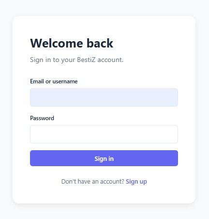
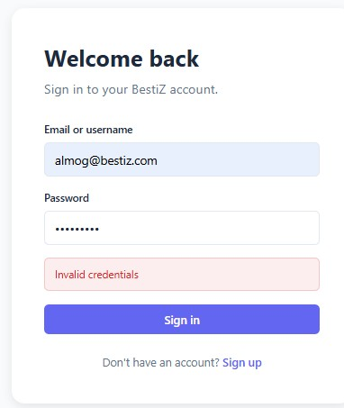
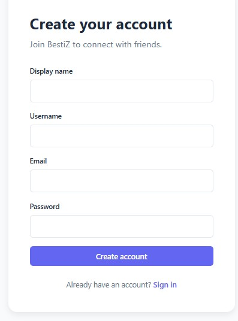
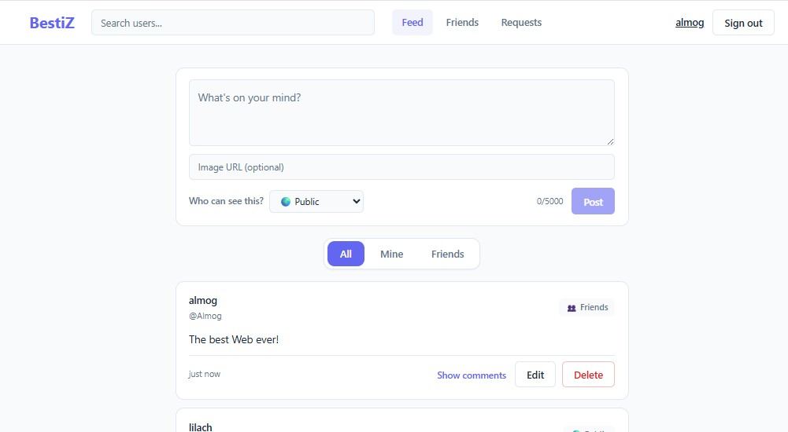
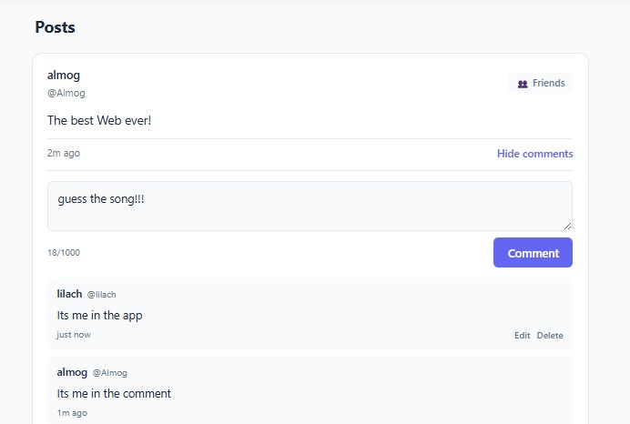
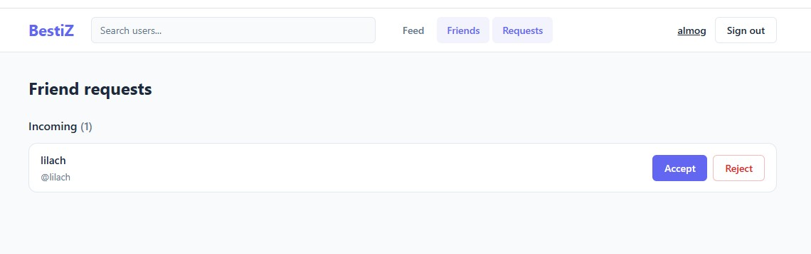
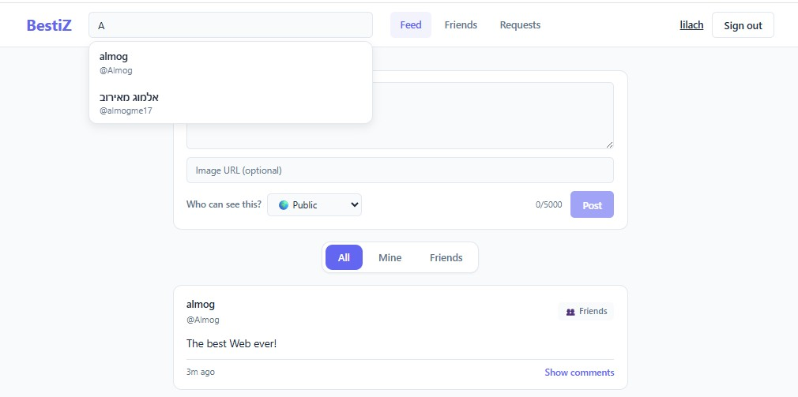
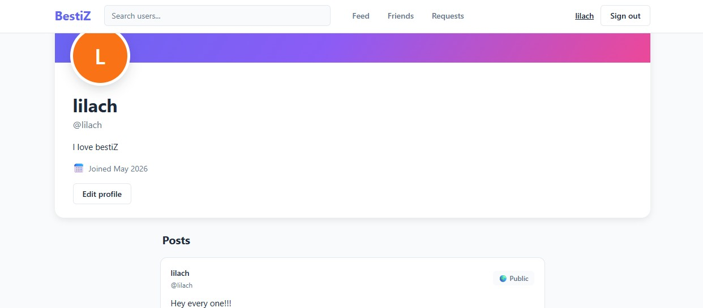

# BestiZ

A real-time social network built with React, Node.js, PostgreSQL, and Socket.IO.

BestiZ is a full-stack social networking application where users can connect with friends, create posts with privacy controls, comment in real time, and browse a personalized feed.

The project focuses on clean backend architecture, relational database design, secure authentication, and real-time synchronization.

---

## Table of Contents

- Features
- Screenshots
- Tech Stack
- Quick Start
- Project Structure
- Architecture Overview
- API Endpoints
- Real-Time Events
- Database
- Security
- Design Decisions
- Future Improvements

---

# Features

## Authentication & Users

• User registration with validation  
• Secure login with bcrypt-hashed passwords  
• JWT authentication with HTTP-only cookies  
• Public user profiles with avatars and bios  

## Friends System

• Send, accept, reject, and cancel friend requests  
• Mutual unfriending  
• Database-enforced friendship uniqueness  
• Prevention of duplicate and reversed requests  

## Posts & Feed

• Create, edit, and delete posts  
• Public / friends-only / private visibility  
• Personalized feed ordered by recency  
• Cursor-based infinite scrolling  
• Feed filters: All / Mine / Friends  

## Comments

• Real-time comments  
• Edit and delete support  
• Live synchronization across connected clients  

## Real-Time Features

• Live post updates  
• Live comment updates  
• Friendship status updates  
• Per-user Socket.IO rooms  

---

# Screenshots

## Authentication

### Sign In


### Invalid Credentials


### Sign Up


---

## Feed & Posts

### Personalized Feed


### Real-Time Comments


---

## Social Features

### Friend Requests


### User Search


---

## User Profiles

### Profile Page


---

# Tech Stack

| Layer | Technology |
|---|---|
| Frontend | React 18, Vite, React Router, CSS Modules |
| Backend | Node.js 20, Express 4 |
| Database | PostgreSQL 16 |
| Real-Time | Socket.IO 4 |
| Authentication | JWT + HTTP-only cookies + bcrypt |
| Validation | Zod |
| Containerization | Docker + Docker Compose |

---

# Quick Start

## Prerequisites

• Docker and Docker Compose installed  
• Ports `5173`, `4000`, and `5432` available  

## Setup

```bash
# Clone the repository
git clone <repository-url>

# Enter the project directory
cd BestiZ

# Create environment variables
cp .env.example .env

# Start the application
docker compose up
```

The PostgreSQL schema initializes automatically on first startup.

## Access

| Service | URL |
|---|---|
| Frontend | http://localhost:5173 |
| Backend API | http://localhost:4000 |
| PostgreSQL | localhost:5432 |

## Stop Services

```bash
docker compose down
```

Remove all data:

```bash
docker compose down -v
```

---

# Project Structure

```plaintext
BestiZ/
├── client/
├── server/
├── docs/
├── docker-compose.yml
├── .env.example
└── README.md
```

---

# Architecture Overview

## Backend Architecture

The backend follows a layered architecture:

```plaintext
Routes
    ↓
Validators
    ↓
Controllers
    ↓
Services
    ↓
Repositories
    ↓
PostgreSQL
```

## Real-Time Architecture

BestiZ uses a broadcast + client-side filtering approach.

> Note: For a production-scale system with stricter security requirements, visibility filtering should ideally happen on the server before broadcasting events.

---

# Database

The complete database documentation, including the full ERD diagram, schema explanation, constraints, indexes, and design decisions, is documented separately in:

📄 [docs/DATABASE.md](./docs/BestiZ_Database_Architecture.md)

---

# Security

**Password Storage**  
Passwords are hashed with bcrypt before storage.

**Session Management**  
JWT tokens are stored in HTTP-only cookies with `SameSite=Lax`.

**SQL Injection Protection**  
All SQL queries use parameterized statements through the `pg` driver.

---

# Future Improvements

• Private messaging UI  
• Notifications system  
• PostgreSQL full-text search  
• User blocking  


