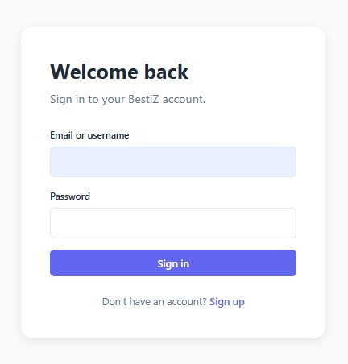
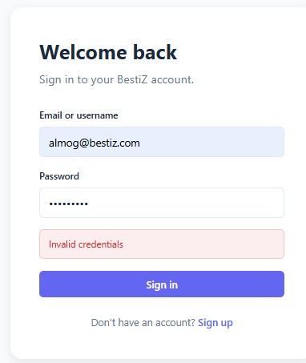
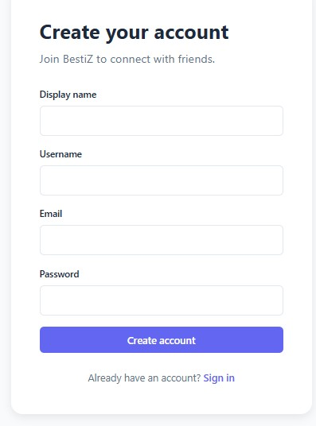
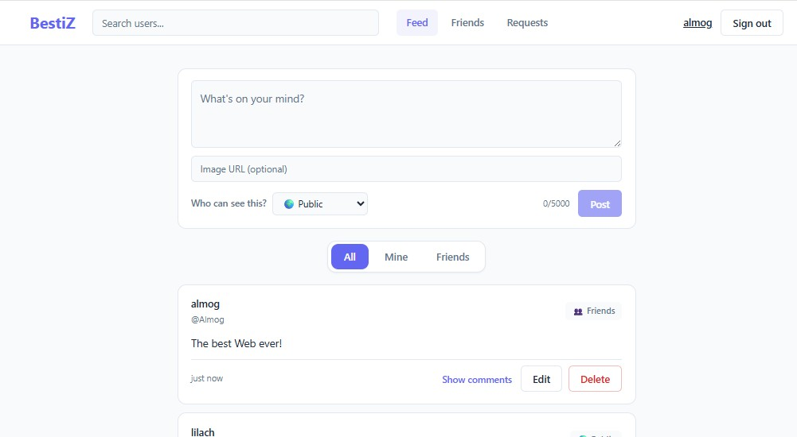
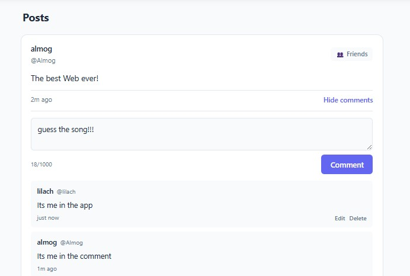
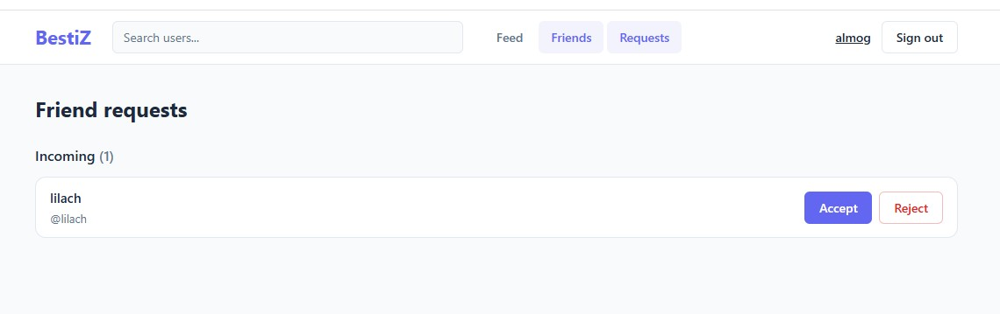
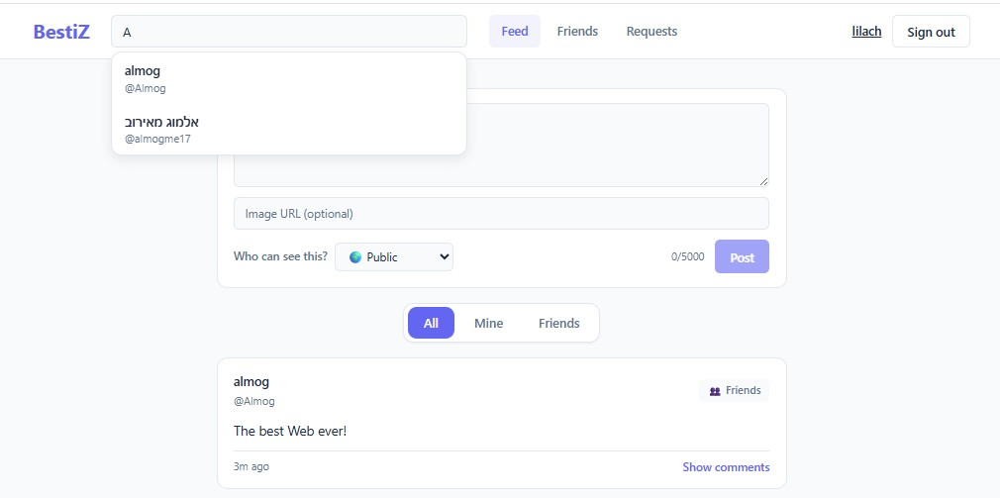
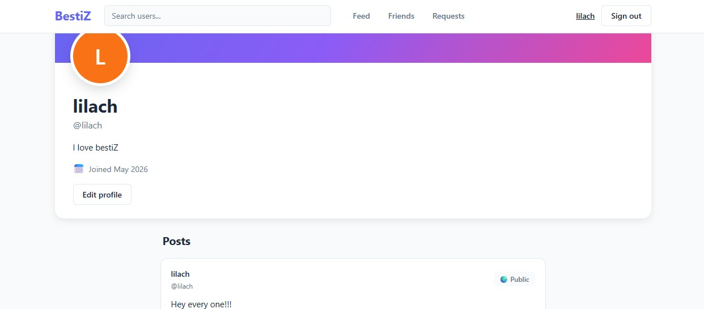

# BestiZ

[](https://github.com/AlmogMeirov/BestiZ/actions/workflows/ci.yml)

A real-time social network built with React, Node.js, PostgreSQL, and Socket.IO.

BestiZ is a full-stack social networking application where users can connect with friends, create posts with privacy controls, comment in real time, and browse a personalized feed.

The project focuses on clean backend architecture, relational database design, secure authentication, and real-time synchronization.

---

## Table of Contents

- [Features](#features)
- [Screenshots](#screenshots)
- [Tech Stack](#tech-stack)
- [Quick Start](#quick-start)
- [Testing](#testing)
- [Project Structure](#project-structure)
- [Architecture Overview](#architecture-overview)
- [API Endpoints](#api-endpoints)
- [Real-Time Events](#real-time-events)
- [Database](#database)
- [Security](#security)
- [Future Improvements](#future-improvements)

---

# Features

## Authentication & Users

• User registration with validation
• Secure login with bcrypt-hashed passwords
• JWT authentication with HTTP-only cookies
• Silent token refresh with rotation, so a 15-minute access token never interrupts a session
• Public user profiles with avatars and bios

## Friends System

• Send, accept, reject, and cancel friend requests
• Mutual unfriending
• Database-enforced friendship uniqueness
• Prevention of duplicate and reversed requests

## Posts & Feed

• Create, edit, and delete posts
• Public / friends-only / private visibility
• Personalized feed ordered by recency
• Cursor-based infinite scrolling
• Feed filters: All / Mine / Friends

## Comments

• Real-time comments
• Edit and delete support
• Live synchronization across connected clients

## Real-Time Features

• Live post updates
• Live comment updates
• Friendship status updates
• Per-user Socket.IO rooms

---

# Screenshots

## Authentication

### Sign In


### Invalid Credentials


### Sign Up


---

## Feed & Posts

### Personalized Feed


### Real-Time Comments


---

## Social Features

### Friend Requests


### User Search


---

## User Profiles

### Profile Page


---

# Tech Stack

| Layer | Technology |
|---|---|
| Frontend | React 18, Vite, React Router, CSS Modules |
| Backend | Node.js 20, Express 4 |
| Database | PostgreSQL 16 |
| Real-Time | Socket.IO 4 |
| Authentication | JWT + HTTP-only cookies + bcrypt |
| Validation | Zod |
| Security | Helmet, express-rate-limit |
| Testing | Vitest, Supertest |
| CI | GitHub Actions |
| Containerization | Docker + Docker Compose |

---

# Quick Start

## Prerequisites

• Docker and Docker Compose installed
• Ports `5173`, `4000`, and `5432` available

## Setup

```bash
# Clone the repository
git clone https://github.com/AlmogMeirov/BestiZ.git

# Enter the project directory
cd BestiZ

# Create environment variables
cp .env.example .env

# Start the application
docker compose up
```

The PostgreSQL schema initializes automatically on first startup.

## Seed demo data

The app starts with an empty database. To populate it with a small social graph —
six users, ten friendships, twelve posts across all three visibility levels, and
comment threads:

```bash
docker compose exec server npm run seed
```

Then sign in as any of `almog`, `maya_l`, `noam_dev`, `tal_r`, `yael_k`, or
`idan_s`, all with the password `Password1!`.

Signing in as `almog` and then as `yael_k` is the quickest way to see the
visibility rules at work: `yael_k` has no friends, so every friends-only post
disappears from her feed.

The seed script is destructive — it truncates every table before inserting, and
refuses to run when `NODE_ENV=production`.

## Access

| Service | URL |
|---|---|
| Frontend | http://localhost:5173 |
| Backend API | http://localhost:4000 |
| PostgreSQL | localhost:5432 |

## Stop Services

```bash
docker compose down
```

Remove all data:

```bash
docker compose down -v
```

---

# Testing

```bash
cd server
npm install
npm test
```

The suite runs in about two seconds and needs no database. Unit tests cover pure
logic; the integration tests drive the real Express app through Supertest with
only the repository layer mocked, so routing, cookie parsing, middleware, and the
error handler all execute for real.

| Suite | Covers |
|---|---|
| `tests/unit/tokens.test.js` | Token signing, expiry, and the separation between access and refresh tokens |
| `tests/unit/authValidators.test.js` | Registration and login schema rules |
| `tests/integration/authRefresh.test.js` | The refresh endpoint: every rejection path, rotation, and cookie flags |
| `tests/integration/security.test.js` | Helmet response headers and both rate limiters |

GitHub Actions runs the suite and a production client build on every push and
pull request. The client build runs on Ubuntu deliberately: its filesystem is
case-sensitive, which catches import-casing bugs that pass silently on Windows
and macOS and break every deployment.

---

# Project Structure

```plaintext
BestiZ/
├── .github/workflows/    # CI pipeline
├── client/
├── server/
│   ├── src/
│   └── tests/            # Unit and integration tests
├── docs/
├── docker-compose.yml
├── .env.example
└── README.md
```

---

# Architecture Overview

## Backend Architecture

The backend follows a layered architecture:

```plaintext
Routes
    ↓
Validators
    ↓
Controllers
    ↓
Services
    ↓
Repositories
    ↓
PostgreSQL
```

## Real-Time Architecture

BestiZ uses a broadcast + client-side filtering approach.

> Note: For a production-scale system with stricter security requirements, visibility filtering should ideally happen on the server before broadcasting events.

---

# API Endpoints

All endpoints are prefixed with `/api`. Authenticated routes read the access
token from an HTTP-only cookie.

## Authentication

| Method | Path | Auth | Description |
|---|---|---|---|
| POST | `/auth/register` | — | Create an account |
| POST | `/auth/login` | — | Sign in and receive auth cookies |
| POST | `/auth/refresh` | Refresh cookie | Exchange a refresh token for a new token pair |
| POST | `/auth/logout` | — | Clear auth cookies |
| GET | `/auth/me` | Yes | Current user |

## Users

| Method | Path | Auth | Description |
|---|---|---|---|
| GET | `/users/search` | Yes | Search users by username |
| GET | `/users/:userId` | Yes | Public profile |
| PATCH | `/users/me` | Yes | Update own profile |

## Friends

| Method | Path | Auth | Description |
|---|---|---|---|
| POST | `/friends/requests` | Yes | Send a friend request |
| GET | `/friends/requests/incoming` | Yes | Requests awaiting your decision |
| GET | `/friends/requests/outgoing` | Yes | Requests you have sent |
| POST | `/friends/requests/:id/accept` | Yes | Accept a request |
| DELETE | `/friends/requests/:id` | Yes | Reject, cancel, or unfriend |
| GET | `/friends` | Yes | Friends list |

## Posts

| Method | Path | Auth | Description |
|---|---|---|---|
| GET | `/posts/feed` | Yes | Personalized feed, cursor-paginated |
| GET | `/posts/users/:userId` | Yes | Posts by a specific user |
| POST | `/posts` | Yes | Create a post |
| GET | `/posts/:postId` | Yes | Single post |
| PUT | `/posts/:postId` | Yes | Edit own post |
| DELETE | `/posts/:postId` | Yes | Delete own post |

## Comments

| Method | Path | Auth | Description |
|---|---|---|---|
| GET | `/posts/:postId/comments` | Yes | Comments on a post |
| POST | `/posts/:postId/comments` | Yes | Add a comment |
| PUT | `/comments/:commentId` | Yes | Edit own comment |
| DELETE | `/comments/:commentId` | Yes | Delete own comment |

---

# Real-Time Events

Socket.IO authenticates during the handshake using the same access-token cookie
as the REST API. Each user joins a private room keyed by their user id, which is
how targeted events reach one person rather than everyone.

| Event | Emitted when |
|---|---|
| `post:created` | A post is published |
| `post:updated` | A post is edited |
| `post:deleted` | A post is removed |
| `comment:created` | A comment is added |
| `comment:updated` | A comment is edited |
| `comment:deleted` | A comment is removed |
| `friend:request_received` | Someone sends you a friend request |
| `friend:request_accepted` | Your request is accepted |
| `friend:removed` | A friendship or pending request is deleted |

---

# Database

The complete database documentation, including the full ERD diagram, schema explanation, constraints, indexes, and design decisions, is documented separately in:

📄 [docs/DATABASE.md](./docs/BestiZ_Database_Architecture.md)

---

# Security

**Password Storage**
Passwords are hashed with bcrypt before storage.

**Session Management**
Access tokens live 15 minutes; refresh tokens live 7 days. Both are stored in
HTTP-only cookies with `SameSite=Lax`, so JavaScript cannot read them. Each token
type is signed with its own secret and carries a `type` claim, so a leaked access
token cannot be replayed against the refresh endpoint.

**Token Refresh & Rotation**
When a request returns 401 the client calls `/api/auth/refresh` once and replays
the original request. Concurrent failures share a single in-flight refresh rather
than firing several in parallel. Every successful refresh issues a new refresh
token, which shortens the window in which a stolen one is useful.

> Rotation is not revocation. The previous refresh token stays valid until it
> expires, because verification is stateless. Persisting issued tokens in the
> database would be the next step if logout-everywhere or breach response were
> required.

**Security Headers**
Helmet sets CSP, `X-Frame-Options`, `X-Content-Type-Options`, `Referrer-Policy`,
and HSTS, and removes the `X-Powered-By` header. `Cross-Origin-Resource-Policy`
is widened to `cross-origin` because the client is served from a different
origin; access is narrowed again by the CORS policy.

**Rate Limiting**
Login and registration allow 10 failed attempts per 15 minutes per IP, which
makes online password guessing impractical while costing real users nothing.
Successful sign-ins do not count against the budget. The rest of the API has a
wider budget. `/api/auth/refresh` is deliberately excluded from the strict
budget, since every active user's browser calls it on a timer they do not
control. Counters are held in memory, which suits a single instance; several
instances would need a shared store.

**SQL Injection Protection**
All SQL queries use parameterized statements through the `pg` driver, with input
validation at the route boundary as a second layer.

---

# Future Improvements

• Private messaging UI — the `messages` table exists in the schema but has no
  feature built on it yet
• Server-side visibility filtering before broadcasting real-time events
• Database-backed refresh token revocation
• Notifications system
• PostgreSQL full-text search
• User blocking
• Image uploads (posts currently accept an image URL)
