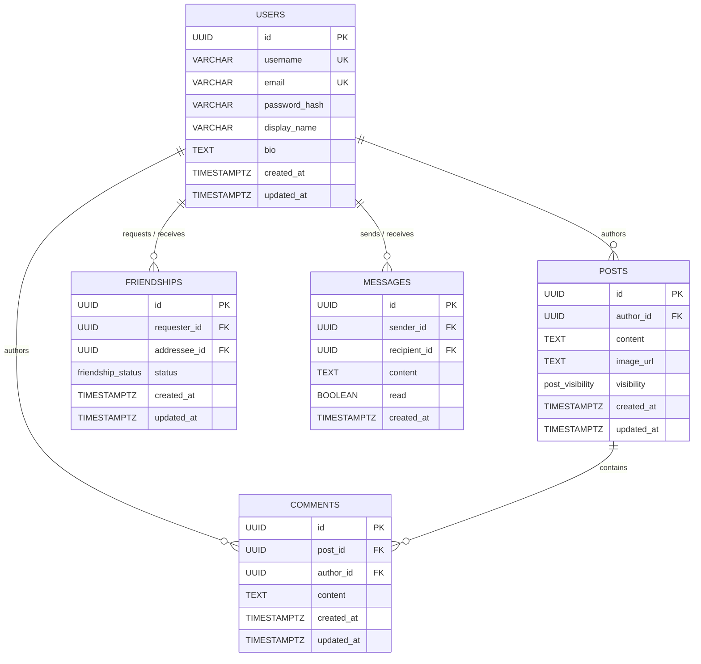

# BestiZ — Database Architecture & Design

## Overview

This document describes the database architecture of **BestiZ**, the reasoning behind the schema design, and the engineering decisions that shaped the system.

The application is built around a relational social-network model that includes:

* Users
* Posts
* Comments
* Friendships
* Private messages (bonus scaffolding)

The schema is implemented in PostgreSQL and initialized automatically during application startup through the migration file:

`server/src/db/migrations/001_initial_schema.sql`

---

# Entity Relationship Structure

## ERD Summary

| Entity        | Purpose                                          | Main Relationships                                          |
| ------------- | ------------------------------------------------ | ----------------------------------------------------------- |
| `users`       | Stores all registered users in the system        | One-to-many with posts, comments, friendships, and messages |
| `posts`       | Stores user-generated posts                      | Belongs to a user, contains comments                        |
| `comments`    | Stores comments on posts                         | Belongs to both a post and a user                           |
| `friendships` | Manages friend requests and accepted friendships | Connects two users                                          |
| `messages`    | Stores private messages between users            | Sender and recipient are both users                         |

## ERD Diagram



> **Note on `messages`** — the table is included as scaffolding for the
> private-messaging bonus feature. It is not currently exposed via API.

---

# Why PostgreSQL?

PostgreSQL was selected because the project is fundamentally relational.

The application relies heavily on:

* Relationships between entities
* Referential integrity
* Cascading behavior
* Constraints and validation
* Efficient joins
* Transaction safety

These requirements align naturally with PostgreSQL's strengths.

## Main Advantages

### Strong Relational Support

Users, posts, comments, and friendships are highly connected entities. PostgreSQL provides efficient JOIN operations and reliable foreign key enforcement.

### Advanced Constraint System

The database uses:

* `UNIQUE` constraints
* `CHECK` constraints
* Foreign keys
* Functional indexes
* ENUM types
* Cascading deletes

This allows the schema itself to protect data integrity instead of depending entirely on application logic.

### Native UUID Support

UUID primary keys provide:

* Non-sequential identifiers
* Better security
* Reduced predictability
* Safer exposure through APIs and URLs

### Production-Ready Ecosystem

PostgreSQL integrates cleanly with:

* Docker
* Node.js (`pg` driver)
* pgAdmin
* DBeaver
* SQL tooling and migrations

---

# Why Not MongoDB?

A document database was considered during the design phase.

However, MongoDB introduces unnecessary complexity for this type of system because:

* Friendships are relational by nature
* Feed generation depends on relationships
* Data duplication becomes harder to manage
* Referential integrity is weaker
* Preventing duplicate friendships becomes more complicated

Using PostgreSQL allowed the system to keep the data normalized and consistent while simplifying complex relationship queries.

---

# Core Design Decisions

## 1. Single `friendships` Table

Instead of separating friend requests and accepted friendships into two tables, the system stores both states inside a single table using a `status` column.

Possible values:

* `pending`
* `accepted`

### Why This Design Was Chosen

#### Simpler Queries

Checking whether two users are connected requires only a single query.

#### Better Consistency

The same uniqueness rules apply to both pending requests and accepted friendships.

#### Reduced Database Operations

Accepting a request only requires an `UPDATE` statement instead of deleting and reinserting rows.

Rejection, cancellation, and unfriending all delete the row — the only two states ever stored are `pending` and `accepted`.

---

## 2. Direction-Agnostic Friendship Uniqueness

Friendships are logically symmetric.

If:

* User A sends a request to User B

then:

* User B should not be able to create another request back to User A.

To enforce this at the database level, the schema uses a functional unique index:

```sql
CREATE UNIQUE INDEX idx_friendships_unique_pair
    ON friendships (
        LEAST(requester_id, addressee_id),
        GREATEST(requester_id, addressee_id)
    );
```

`LEAST/GREATEST` normalize the pair to a canonical order, so `(A, B)` and `(B, A)` produce the same key and the second insert is rejected by PostgreSQL.

### Why This Matters

This guarantees:

* No duplicate friendships
* No reversed duplicate requests
* No race-condition duplicates

The rule is enforced directly by PostgreSQL instead of relying only on backend validation.

---

## 3. Cascading Deletes

The schema uses `ON DELETE CASCADE` extensively.

### Example

If a user is deleted:

* Their posts are deleted
* Their comments are deleted
* Their friendships are deleted
* Their messages are deleted

Similarly, deleting a post automatically removes all comments related to it.

### Benefits

* Prevents orphaned rows
* Simplifies backend cleanup logic
* Keeps the database consistent automatically

---

## 4. UUID Primary Keys

Every table uses UUIDs instead of sequential integers.

### Advantages

Sequential IDs expose information such as:

* Total row count
* Resource creation order
* Predictable API endpoints

UUIDs avoid these problems and also support future distributed systems and easier data merging across environments.

The cost is a slightly larger index size, which is negligible at this scale.

---

## 5. Query-Oriented Index Design

Indexes were added only when they support actual application queries.

| Index                              | Used by                                          |
| ---------------------------------- | ------------------------------------------------ |
| `idx_users_username_lower`         | Case-insensitive username lookup (login)         |
| `idx_users_email_lower`            | Case-insensitive email lookup and conflict check |
| `idx_friendships_unique_pair`      | Enforce no-duplicate pairs                       |
| `idx_friendships_addressee_status` | "Show me my incoming pending requests"           |
| `idx_friendships_requester_status` | "Show me my outgoing pending requests"           |
| `idx_posts_author_created`         | User profile post list, newest first             |
| `idx_posts_created_at`             | Global feed pagination by recency                |
| `idx_comments_post_created`        | Comments under a post, oldest-first              |

### Design Philosophy

No speculative indexes were added. Every index exists because the application actively uses it.

This avoids:

* Unnecessary storage overhead
* Slower writes
* Redundant indexing

---

## 6. Automatic `updated_at` Management

The database uses triggers to maintain `updated_at` values automatically.

### Why?

Application code can accidentally forget to update timestamps.

Database-level triggers guarantee consistency regardless of:

* API path
* Migration scripts
* Administrative updates
* Future services

This makes the system more reliable and reduces repetitive backend logic.

---

## 7. ENUM Types for Controlled States

The schema defines closed-state values using PostgreSQL ENUM types.

### Examples

#### Friendship Status

* `pending`
* `accepted`

#### Post Visibility

* `public`
* `friends`
* `private`

### Advantages

* Prevents invalid values
* Improves schema readability
* Enforces consistency
* Provides lightweight validation directly in SQL

The cost — adding a new value requires `ALTER TYPE` — is acceptable for sets that are unlikely to change.

---

# Data Integrity Strategy

A major design principle of the project is:

> "The database should protect itself whenever possible."

Instead of trusting only backend code, the schema itself enforces rules through:

* Foreign keys
* Unique constraints
* ENUMs
* Functional indexes
* Cascading deletes
* Triggers

This minimizes the risk of corrupted or inconsistent data.

---

# Future Extensions

The current architecture was intentionally designed to support future features such as:

* Real-time messaging
* Notifications
* Post reactions
* Media uploads
* Group chats
* Shared posts
* User blocking
* Soft deletes
* Feed ranking algorithms

The relational structure already provides a strong foundation for these additions.

---

# Conclusion

The BestiZ database architecture focuses on:

* Data integrity
* Simplicity
* Maintainability
* Performance
* Relational consistency

PostgreSQL was chosen because it provides strong support for the exact type of interconnected data the application manages.

By enforcing critical rules directly at the database layer, the system remains predictable, secure, and easier to maintain as the project grows.
